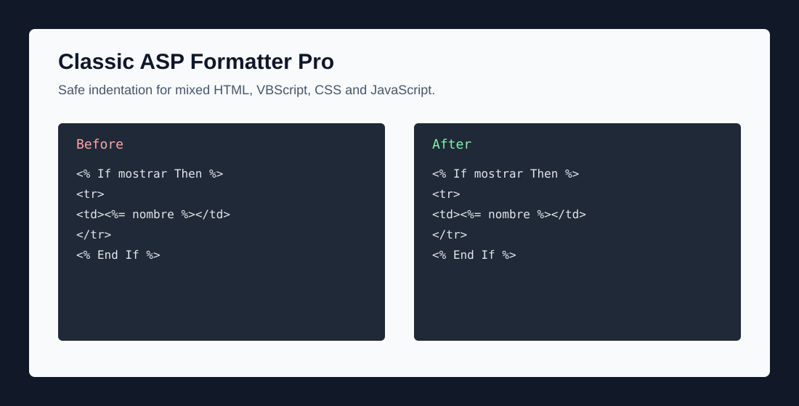

# Classic ASP Formatter Pro

A professional Visual Studio Code formatter for Classic ASP files with mixed HTML, CSS, JavaScript and embedded VBScript.

Classic ASP applications often mix server-side VBScript, HTML markup, inline ASP expressions, CSS, JavaScript and include directives in the same `.asp` file. Classic ASP Formatter Pro provides a conservative formatter focused on safe indentation without rewriting legacy business logic.

## Demo



## Why this exists

Classic ASP files often contain VBScript, HTML, CSS, JavaScript, SQL strings and include directives in a single document. Existing formatters usually break these files or only understand HTML. This extension focuses on safe indentation for legacy ASP codebases.

## Features

- Registers the `asp` language for `.asp` and `.asa` files.
- Provides `Format Document` support through the official VS Code Extension API.
- Adds commands for safe formatting and formatting-risk analysis.
- Segments HTML, ASP blocks, ASP inline expressions, ASP directives, includes, comments, `<script>` and `<style>` blocks.
- Indents VBScript control structures such as `If`, `Else`, `For`, `Select Case`, `Function`, `Sub`, `Class`, and `With`.
- Applies structural ASP indentation to surrounding HTML.
- Preserves ASP inline expressions inside HTML attributes.
- Formats CSS and JavaScript conservatively using brace-based indentation.
- Includes safe mode for ambiguous ASP blocks.

## Before

```asp
<table>
<% If mostrarClientes Then %>
<tr>
<td>Nombre</td>
<td>Precio</td>
</tr>
<% End If %>
</table>
```

## After

```asp
<table>
    <% If mostrarClientes Then %>
        <tr>
            <td>Nombre</td>
            <td>Precio</td>
        </tr>
    <% End If %>
</table>
```

## Installation

Install dependencies:

```bash
npm install
```

Compile the extension:

```bash
npm run compile
```

Open the project in Visual Studio Code and press `F5` to launch an Extension Development Host. Open a `.asp` file and run `Format Document`.

## Commands

| Command | Description |
| --- | --- |
| `Classic ASP: Format Document Safely` | Formats the active document only when no obvious ASP delimiter risk is detected. |
| `Classic ASP: Analyze Formatting Risks` | Scans the active document for unmatched ASP delimiters and risky delimiter-like strings. |

## Configuration

| Setting | Default | Description |
| --- | --- | --- |
| `classicAspFormatterPro.indentSize` | `4` | Number of spaces per indentation level. |
| `classicAspFormatterPro.useTabs` | `false` | Use tabs instead of spaces. |
| `classicAspFormatterPro.formatHtml` | `true` | Format HTML segments. |
| `classicAspFormatterPro.formatAsp` | `true` | Format ASP/VBScript segments. |
| `classicAspFormatterPro.formatCss` | `true` | Format CSS segments. |
| `classicAspFormatterPro.formatJavaScript` | `true` | Format JavaScript segments. |
| `classicAspFormatterPro.safeMode` | `true` | Skip formatting when ASP delimiters are ambiguous. |
| `classicAspFormatterPro.normalizeVbScriptKeywords` | `false` | Normalize common VBScript keyword casing. |
| `classicAspFormatterPro.preserveBlankLines` | `true` | Preserve blank lines while formatting. |

Example `.vscode/settings.json`:

```json
{
  "classicAspFormatterPro.indentSize": 4,
  "classicAspFormatterPro.useTabs": false,
  "classicAspFormatterPro.safeMode": true
}
```

## Development

Run the TypeScript compiler:

```bash
npm run compile
```

Run the test suite:

```bash
npm test
```

Run linting:

```bash
npm run lint
```

GitHub Actions runs compile, lint and tests on push and pull requests.

## Test Fixtures

Formatter behavior is covered with fixture pairs in `fixtures/` and `src/test/fixtures/`. Each `.input.asp` file has a matching `.expected.asp` file so regressions are easy to review.

Current high-risk coverage includes:

- ASP `If / Else / End If` blocks around HTML.
- `Select Case` indentation.
- Inline ASP expressions in HTML text and attributes.
- ASP snippets inside attributes such as `class`, `href`, and `option`.
- JavaScript blocks containing inline ASP expressions.
- Safe mode risk detection for unmatched delimiters and delimiter-like strings.

## Examples

The `examples/` directory contains realistic Classic ASP samples:

- `simple-table.asp`
- `form-with-validation.asp`
- `mixed-html-vbscript-js.asp`
- `select-case-page.asp`
- `include-directives.asp`
- `legacy-large-before.asp`
- `legacy-large-after.asp`

## Packaging

Package a VSIX with:

```bash
npm run package
```

The generated `.vsix` file is ignored by Git. Commit the source code and create release artifacts from CI or from a clean local build.

Before publishing to the Visual Studio Marketplace, make sure the `publisher` field in `package.json` matches your Marketplace publisher ID.

## What It Does Not Do

- It does not refactor VBScript.
- It does not rewrite SQL strings.
- It does not guarantee semantic formatting for malformed HTML.
- It does not replace a full parser.
- It does not reorder includes, functions, variables or business logic.

## Known Limitations

- The HTML formatter is intentionally conservative and line-oriented.
- JavaScript and CSS formatting is brace-based and not a full parser.
- Safe mode skips documents with unmatched ASP delimiters.
- The formatter does not reorder includes, functions, variables or logic.
- SQL inside strings is preserved because the formatter does not parse or rewrite string contents.

## Roadmap

### v0.1

- Basic ASP/VBScript formatter
- HTML/ASP segmenter
- Format Document support for `.asp`

### v0.2

- Global ASP + HTML indentation
- Structural ASP indentation affecting HTML

### v0.3

- Conservative CSS and JavaScript formatting
- Inline ASP placeholders

### v0.4

- More VBScript indentation rules
- Better handling for `Select Case`, `With`, and `Class`

### v1.0

- Stable formatter for large ASP files
- Visual Studio Marketplace publication
